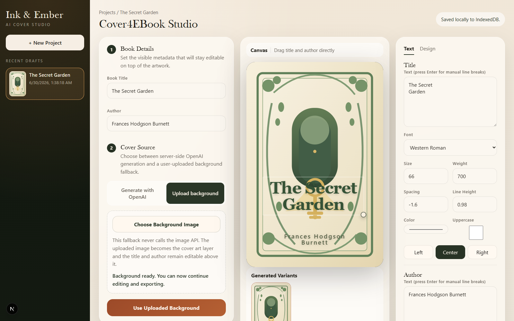
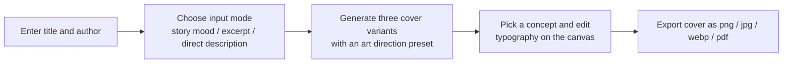
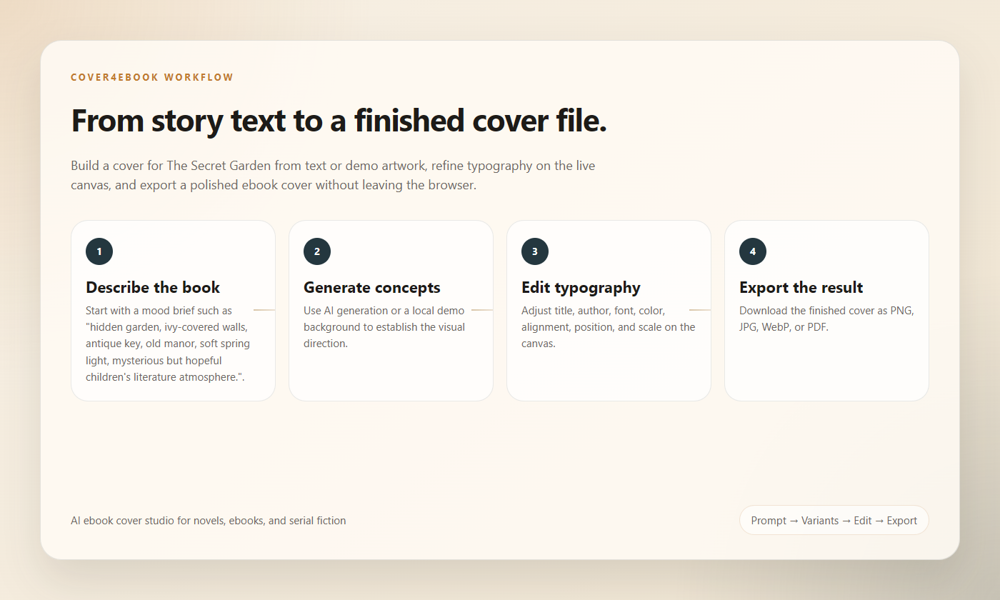

# Cover4EBook

*Turn raw story mood into a finished ebook cover in minutes.*

Cover4EBook is an AI ebook cover studio for books, web novels, and story drafts that do not already have a cover. Paste a passage, describe the mood, or write a direct prompt, generate multiple cover concepts, refine title and author typography in the browser, and export the final design as `png`, `jpg`, `webp`, or `pdf`.

[](https://nextjs.org/)
[](https://www.typescriptlang.org/)
[](https://platform.openai.com/)
[](#roadmap)
[](#license)


See [assets/readme/README_ASSETS.md](assets/readme/README_ASSETS.md) for the capture plan and asset provenance.

## Why Cover4EBook

Most ebook and web novel drafts live in an awkward gap:

- they need a cover before publication, sharing, or storefront listing
- stock design tools are too manual for early-stage ideas
- image generators can create artwork, but not a usable finished cover with editable title and author layout

Cover4EBook closes that gap with a focused workflow: prompt for mood, generate several base directions, tune typography visually, and export a ready-to-use cover file without leaving the browser.

## Features

| Feature | What it does | Why it matters |
| --- | --- | --- |
| AI cover concept generation | Generate multiple cover-art variants from a story mood, excerpt, or direct description | Helps users move from text to visual direction quickly |
| In-browser title and author editing | Edit text, font, color, alignment, position, width, and size directly on the canvas | Keeps the cover usable as a real publishing asset, not just raw art |
| Curated art direction presets | Start from built-in visual styles such as literary, pulp, noir, or minimal | Makes prompting easier for non-designers |
| Upload mode without API | Upload your own background art and keep using the same editor | Works as a no-API fallback and supports custom artwork |
| Local draft persistence | Save drafts in IndexedDB and remember the active project in local storage | Lets users iterate without setting up accounts or backend storage |
| Multi-format export | Export to `png`, `jpg`, `webp`, or `pdf` from the browser-side composed canvas | Covers both quick sharing and print-oriented output |
| Browser-friendly file saving | Uses `showSaveFilePicker` when supported and falls back to normal download | Keeps export practical across browsers |
| Acceptance test coverage | Includes Playwright acceptance flows for generation, editing, exporting, and upload mode | Supports regression checks for the full studio flow |

## Demo Gallery

| Concept A | Concept B | Concept C |
| --- | --- | --- |
|  |  |  |

These covers are static README artwork generated with Codex's built-in image generation tool. The tool does not expose its underlying model identifier, and the images do not represent API calls made by the Cover4EBook application.



## Workflow



1. Enter the book title and author.
2. Choose one source mode: `story_mood`, `excerpt`, or `direct_description`.
3. Add source text and pick an art direction preset, with an optional style override.
4. Generate three cover variants, then select the direction you want to refine.
5. Adjust title and author text with manual line breaks, drag-and-drop positioning, resize handles, font controls, color controls, and layout presets.
6. Export the final cover in the format you need.



## Quick Start

### Requirements

- Node.js
- npm
- An OpenAI API key if you want AI image generation

### Run locally

```bash
npm install
```

Create your local environment file from `.env.example`, then provide `OPENAI_API_KEY`.

```bash
npm run dev
```

Open [http://localhost:3000](http://localhost:3000).

## Environment Variables

| Variable | Required | Default | Purpose |
| --- | --- | --- | --- |
| `OPENAI_API_KEY` | Yes for AI generation | None | Server-side OpenAI API key used for image generation |
| `OPENAI_IMAGE_MODEL` | No | `gpt-image-1` | Override the image model |
| `OPENAI_IMAGE_QUALITY` | No | `high` | Override requested image quality |
| `COVER4EBOOK_ACCEPTANCE_MOCK` | No | `0` | Enables mock image generation for acceptance testing |

## No API? Use Upload Mode

If you do not want to call the OpenAI API, or already have your own artwork:

1. Switch the studio to `Upload background`.
2. Choose a local image file.
3. Use the uploaded image as the active cover background.
4. Continue editing title and author overlays exactly the same way.
5. Export as usual.

This keeps Cover4EBook useful even without a generation key.

## Tech Stack

| Layer | Tools |
| --- | --- |
| App framework | Next.js App Router |
| Language | TypeScript |
| Image generation | OpenAI Images API |
| Local persistence | IndexedDB plus local storage for active project memory |
| Rendering and export | Browser canvas composition plus `jspdf` for PDF export |
| Validation | Zod |
| Testing | Vitest, Testing Library, Playwright |

## Quality Checks

Run the standard local checks:

```bash
npm run lint
npm run typecheck
npm run test
```

For browser acceptance:

```powershell
powershell -ExecutionPolicy Bypass -File .\scripts\run_playwright_acceptance.ps1
```

Playwright acceptance is configured to prefer local Microsoft Edge with `channel: "msedge"`. If Edge is unavailable, it falls back to Playwright Chromium.

The acceptance flow covers:

- homepage
- generated state
- editing state
- export state
- upload-background fallback state

Screenshots are written to `output/playwright/screenshots/`.

## Development Notes

- The app is a direct-to-studio experience rather than a separate marketing landing page.
- Drafts are stored locally in IndexedDB. The active project id is remembered in local storage.
- Image generation uses a normal OpenAI API key on the server only. The key is not exposed to the frontend bundle.
- Cover4EBook does not attempt to reuse a Codex or ChatGPT login session for image generation. Use a standard OpenAI API key instead.
- `next build` should work in a normal environment. In this managed Windows sandbox, the build directory can sometimes be locked by the host and trigger `EPERM` during `rename` or `unlink`.

## Open Source Safety

- Local environment files, keys, logs, databases, and generated outputs are excluded by repository ignore rules.
- API keys are read server-side and are not shipped to the browser bundle.
- Uploaded files and drafts stay local to the browser unless the user explicitly exports a cover.
- The project is designed for anonymous local use and does not include cloud account storage in this version.

## Roadmap

- Optional motion demo assets
- More art direction packs and typography presets
- Batch export for multiple selected variants
- Template presets for genre-specific title layouts
- Shareable project import and export
- Stronger print-oriented export controls

## License

No `LICENSE` file is committed in the repository yet, so the project is currently license-unspecified. Add the intended open source license before public distribution.
